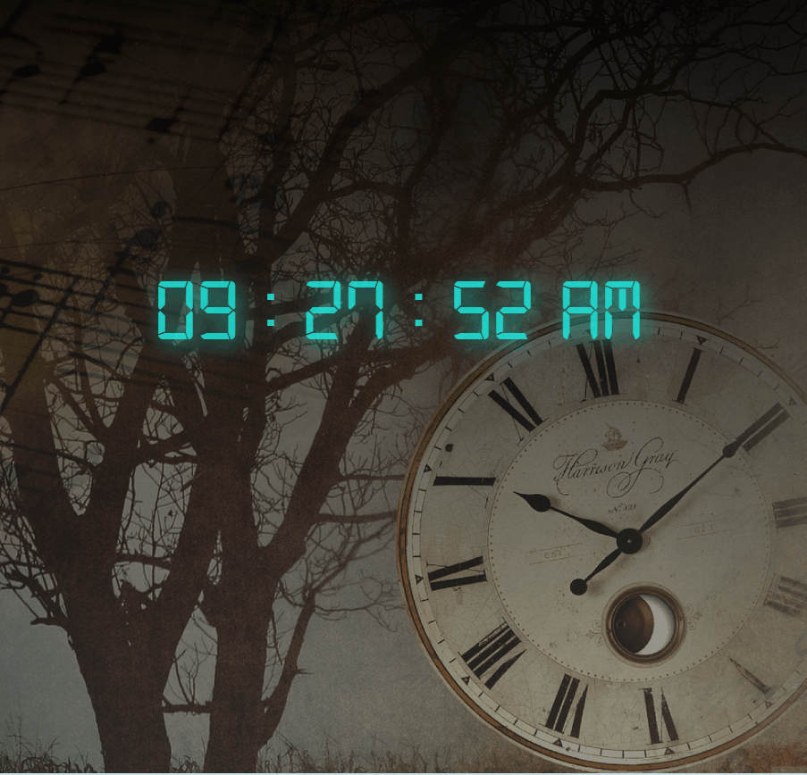

# Digital_clock

## Description

Our goal in this project is to create Digital_clock using JavaScript.

## Outcome

## Objective

In this project, JavaScript new Date methods used for getting information from a date object.
    

<button><a href="https://muratbzc.github.io/Digital_clock/">Go To Web Site</a></button>
